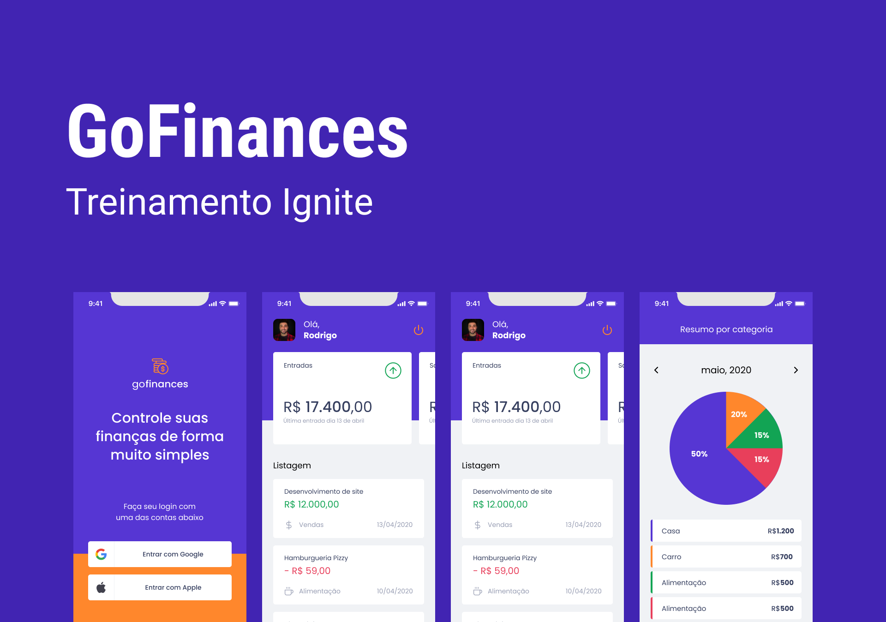

<h1 align="center">
  
</h1>

<p align="center">
  

 
</p>





## 💻 Projeto
GoFinance is a Mobile application with the objective of controlling your finances, allowing you to register entries, exits and categorize them in an organized way!

## ✨ Technologies

-   [X] React Native
-   [X] Typescript
-   [X] Expo
-   [X] Context API
-   [X] Async Storage
-   [X] Axios
-   [X] Expo Google Fonts
-   [X] React Navigation Stack
-   [X] React Native Gesture Handler
-   [X] Expo Authentication

## Running the project

Use **yarn** or **npm install** to install project dependencies.
Then start the project.

```cl
expo start
```

## 📄 Licença

This project is under the MIT license. See the [LICENSE](LICENSE.md) file for more details.

<br />

<div align="center">
  <small>Developed for Gabriel Merigo</small>

  [](https://www.linkedin.com/in/thiago-furtado-silva/) 
</div>
